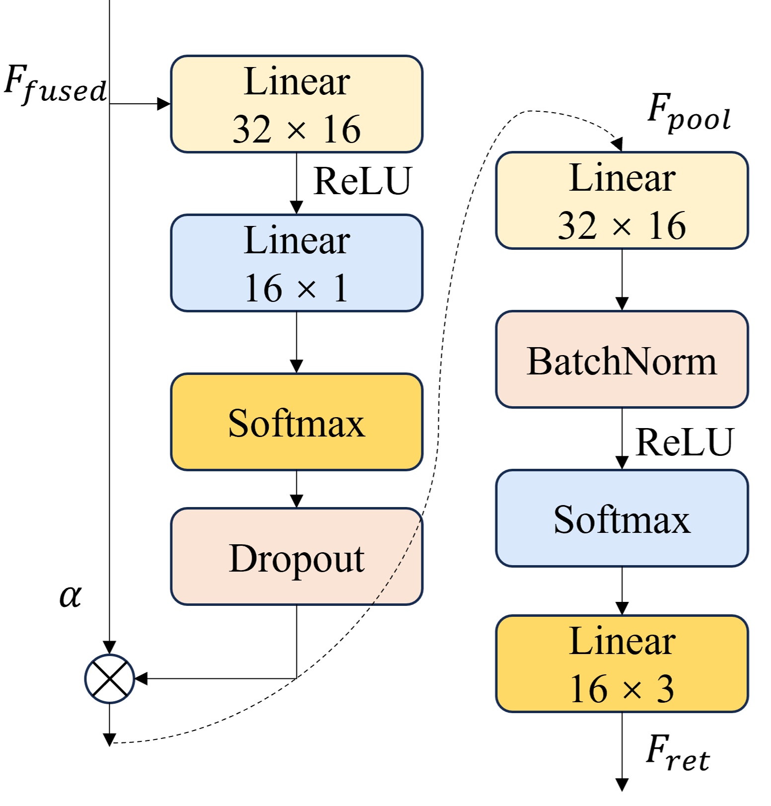

# PAFTI-Net: A Parallel Deep Learning Model for Termite Infestation Level Prediction Using Gas Monitoring Data
> Official Project Repository |  Paper

  <!--  -->
  <!--  -->
  
  
  

---

## 💰 Funding & Data Statement / 基金与数据声明

This research was supported by Zhejiang Provincial Natural Science Foundation of China under Grant No. LY23C140004.
In collaboration with local government departments, this project has signed relevant confidentiality agreements. For this reason, we only display partial data samples instead of sharing the complete raw data.

---

## 🎯 Research Background / 研究背景
Termites are destructive pests that threaten buildings, water conservancy projects and cultural relics, causing global economic losses of up to 40 billion USD annually. With global warming, the activity range of termites continues to expand.

1. Traditional monitoring methods such as manual inspection have the disadvantages of high cost, slow response and limited coverage;
2. Most existing intelligent monitoring devices only support qualitative judgment of termite activity, and cannot quantify pest population and infestation level;
3. Termite metabolism produces a large amount of $CO_2$ and $CH_4$, and gas concentration is positively correlated with termite quantity, but quantitative prediction under complex environmental interference is insufficient;
4. Conventional time series models cannot effectively balance local feature extraction, global dependency modeling and multi-factor nonlinear coupling.

This study takes Zhuji City, Zhejiang Province as the research area, builds a complete monitoring and data analysis pipeline, and proposes a parallel deep learning model to achieve accurate classification of termite infestation levels.

---

## 🧠 Model Architecture / PAFTI-Net 模型结构
PAFTI-Net follows the design logic: `Adaptive Feature Enhancement → Multi-path Parallel Feature Extraction → Dynamic Fusion → Classification`.

The whole network consists of four core modules:
1. **AFFM (Adaptive Feature Fusion Module)**: Dynamically weight input features, enhance valid signals and suppress noise;
2. **PPEM (Parallel Path Extraction Module)**: Three parallel branches for multi-scale local features, global time dependencies and factor interaction features;
   - MCP: Multi-scale 1D Convolution Path (capture local fluctuations)
   - CFM: Cross-Time Fusion Module (Transformer-based global dependency modeling)
   - FIP: Factor Interaction Path (mine nonlinear coupling between multiple factors)
3. **DPFM (Dynamic Path Fusion Module)**: Adaptively fuse features from three branches;
4. **Classification Head**: Temporal attention pooling + fully connected layers to output infestation level.

<!-- 此处放置模型整体结构图 -->

<i>Figure 3. Overall architecture of the proposed PAFTI-Net</i>

<!-- 此处放置分类头细节图 -->

<i>Figure 4. Structure of classification module</i>

---

